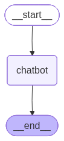

# AI Agents Apps

Collection of small AI agent demos, grouped by framework and topic.

```
ai-agents-apps/
├── langgraph/          # LangGraph workflows
├── langchain/          # LangChain agents, retrieval, multimodal
│   ├── agents/
│   ├── retrieval/
│   └── multimodal/
├── RAG/                # End-to-end RAG apps
├── crewAI/             # CrewAI multi-agent crews
└── guardrails/         # LangChain guardrails & middleware
└── langsmith/          # LangSmith Academy course (notebooks)
    └── langsmith-pynb/
```

## LangGraph (`langgraph/`)

1. Basic chatbot LangGraph (`langgraph/basic-chatbot-langgraph/`):
   - Minimal **LangGraph** chatbot: a `StateGraph` with `messages` + `add_messages`, one **`chatbot`** node (`START` → `chatbot` → `END`) that calls **`init_chat_model`** (`claude-haiku-4-5-20251001`) via `llm.invoke`. `main.py`.

   

2. Multi-node chatbot LangGraph (`langgraph/multi-node-chatbot-langgraph/`):
   - **LangGraph** workflow: **`classifier`** node (`with_structured_output` → `emotional` | `logical`), **`router`** node, then **`add_conditional_edges`** to **`therapist`** or **`logical`** assistant nodes and **`END`**. Shared state: **`messages`** (`add_messages`) and **`message_type`**.

   

## LangChain agents (`langchain/agents/`)

3. Researcher-agent-langchain (`langchain/agents/researcher-agent-langchain/`):
   - CLI research assistant built with **LangChain** and **Claude** (`ChatAnthropic`).
   - You enter a topic; a **tool-calling agent** (LangChain classic `AgentExecutor`) can search the web (DuckDuckGo), pull context from Wikipedia, and append results to a local text file.
   - The model is steered to return structured output matching a **Pydantic** schema (topic, summary, sources, tools used).

4. Weather tool LangChain (`langchain/agents/weather-tool-langchain/`):
   - **LangChain** `create_agent` with one tool: **`get_weather`** (wttr.in `j1` JSON), **OpenAI** `gpt-4.1-mini`, humorous system prompt.
   - `main.py`: `invoke` for a single reply; optional **`stream_mode="messages"`** for token streaming.

5. Memory tools LangChain (`langchain/agents/memory_tools_langchain/`):
   - **LangChain** `create_agent` with **`get_weather`** (wttr.in `j1` JSON) and **`locate_user`** (resolves city from **`ToolRuntime`** + **`Context`** `user_id`: ABC → Noida, etc.).
   - **Structured output** via a **`ResponseFormat`** dataclass (summary, temps, humidity); **`init_chat_model`** / `gpt-4.1-mini`, humorous system prompt.
   - **Thread memory**: **`InMemorySaver`** checkpointer + `configurable.thread_id` so a second `invoke` (“Is this usual?”) reuses prior turns on the same thread; changing `thread_id` drops that memory.

## LangChain retrieval (`langchain/retrieval/`)

6. FAISS LangChain (`langchain/retrieval/faiss-langchain/`):
   - In-memory semantic retrieval demo using **FAISS** + **OpenAIEmbeddings** (`text-embedding-3-large`) over a tiny hardcoded text corpus (Apple/MacBooks/oranges/Thinkpads/pears).
   - Builds a retriever (`k=3`), wraps it as a tool via **`create_retriever_tool`** (`kb_search`), and plugs it into a **LangChain** `create_agent` (`gpt-4.1-mini`).
   - System prompt instructs the model to call `kb_search` first for relevant questions, then answer concisely (can call multiple times).

## LangChain multimodal (`langchain/multimodal/`)

7. Image LangChain (`langchain/multimodal/image_langchain/`):
   - **Vision** over a remote image URL: **`init_chat_model`** (`gpt-4.1-mini`) + **`HumanMessage`** whose `content` is a list of **`text`** + **`image`** (`url`) blocks, then **`model.invoke([message])`** and print **`response.content`**.
   - `main.py`; commented block shows the equivalent dict-style message shape.

## RAG (`RAG/`)

8. Local AI Agent RAG (`RAG/local-ai-agent-RAG/`):
   - Local **RAG** over restaurant reviews: **Chroma** + **Ollama** embeddings (`mxbai-embed-large`), generation with **Ollama** (`gpt-oss:20b`).
   - `vector.py` builds/refreshes a persisted Chroma DB from `realistic_restaurant_reviews.csv`; `main.py` loops on stdin, retrieves top chunks for each question, and runs a LangChain `ChatPromptTemplate | OllamaLLM` chain.

## CrewAI (`crewAI/`)

9. Stock briefing crewai (`crewAI/stock_briefing_crewai/`):
   - Multi-agent **CrewAI** crew (sequential) that builds a **daily stock brief** for a ticker: a **collector** pulls price and headlines (via **yfinance** and custom tools), then **summarizer**, **risk_checker**, and **brief_writer** agents refine the output through tasks defined in YAML.
   - Managed with **uv**; run from that directory with `crewai run` after `crewai install` and setting `OPENAI_API_KEY` in `.env`.
   - Default kickoff input is `ticker` (e.g. `AAPL` in `main.py`).

## Guardrails (`guardrails/`)

LangChain **guardrails** demos — built-in middleware and custom `AgentMiddleware` (uv-managed, Python 3.14). Each app needs `OPENAI_API_KEY` in `.env`. Run from the project folder with `uv run main.py`.

10. PII detection LangChain (`guardrails/pii-detection-langchain/`):
    - **LangChain** `create_agent` with **`PIIMiddleware`** on user input before the model sees it.
    - Strategies: **redact** emails, **mask** credit cards, **block** API keys (custom `sk-...` detector).
    - Ref: [LangChain guardrails](https://docs.langchain.com/oss/python/langchain/guardrails#built-in-guardrails)

11. Human-in-the-loop LangChain (`guardrails/human-in-loop-langchain/`):
    - **LangChain** `create_agent` with **`HumanInTheLoopMiddleware`**: sensitive tools (`send_email`, `delete_records`) require approval; safe tools (`search_web`) run automatically.
    - **`InMemorySaver`** checkpointer + `thread_id` so the agent pauses until a human resumes with **`Command(resume=...)`** (`approve` or `reject` with reason).
    - Ref: [LangChain guardrails](https://docs.langchain.com/oss/python/langchain/guardrails#built-in-guardrails)

12. Custom guardrails LangChain (`guardrails/custom-guardrails/`):
    - Custom **`AgentMiddleware`** subclasses plugged into **`create_agent`** via the `middleware` list.
    - **`ContentFilterMiddleware`** (`before_agent`): deterministic keyword guardrail — scans the first user message for banned terms (`hack`, `exploit`, `malware`) and **`jump_to: "end"`** before the agent runs.
    - **`SafetyGuardrailMiddleware`** (`after_agent`, commented in `main.py`): model-based guardrail — **`gpt-5.4-mini`** labels the final AI reply `SAFE` or `UNSAFE` and replaces unsafe output with a refusal message.
    - Ref: [LangChain guardrails](https://docs.langchain.com/oss/python/langchain/guardrails#built-in-guardrails)

## LangSmith (`langsmith/`)

13. Introduction to LangSmith (`langsmith/langsmith-pynb/`):
    - Jupyter notebooks across five modules: tracing & observability (module 0–1), datasets/evaluators/experiments (module 2), prompt engineering & Prompt Hub (module 3), human feedback (module 4), production monitoring & online evaluation (module 5).
