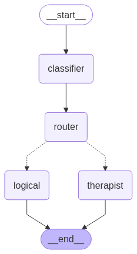

# AI Agents Apps

1. Researcher-agent-langchain:
   - CLI research assistant built with **LangChain** and **Claude** (`ChatAnthropic`).
   - You enter a topic; a **tool-calling agent** (LangChain classic `AgentExecutor`) can search the web (DuckDuckGo), pull context from Wikipedia, and append results to a local text file.
   - The model is steered to return structured output matching a **Pydantic** schema (topic, summary, sources, tools used).

2. Local AI Agent RAG:
   - Local **RAG** over restaurant reviews: **Chroma** + **Ollama** embeddings (`mxbai-embed-large`), generation with **Ollama** (`gpt-oss:20b`).
   - `vector.py` builds/refreshes a persisted Chroma DB from `realistic_restaurant_reviews.csv`; `main.py` loops on stdin, retrieves top chunks for each question, and runs a LangChain `ChatPromptTemplate | OllamaLLM` chain.

3. Stock briefing crewai:
   - Multi-agent **CrewAI** crew (sequential) that builds a **daily stock brief** for a ticker: a **collector** pulls price and headlines (via **yfinance** and custom tools), then **summarizer**, **risk_checker**, and **brief_writer** agents refine the output through tasks defined in YAML.
   - Managed with **uv**; run from that directory with `crewai run` after `crewai install` and setting `OPENAI_API_KEY` in `.env`.
   - Default kickoff input is `ticker` (e.g. `AAPL` in `main.py`).

4. Basic chatbot LangGraph:
   - Minimal **LangGraph** chatbot: a `StateGraph` with `messages` + `add_messages`, one **`chatbot`** node (`START` → `chatbot` → `END`) that calls **`init_chat_model`** (`claude-haiku-4-5-20251001`) via `llm.invoke`. `main.py`.

   - Graph here

   

5. Multi-node chatbot LangGraph:
   - **LangGraph** workflow: **`classifier`** node (`with_structured_output` → `emotional` | `logical`), **`router`** node, then **`add_conditional_edges`** to **`therapist`** or **`logical`** assistant nodes and **`END`**. Shared state: **`messages`** (`add_messages`) and **`message_type`**.

   - Graph here

   
