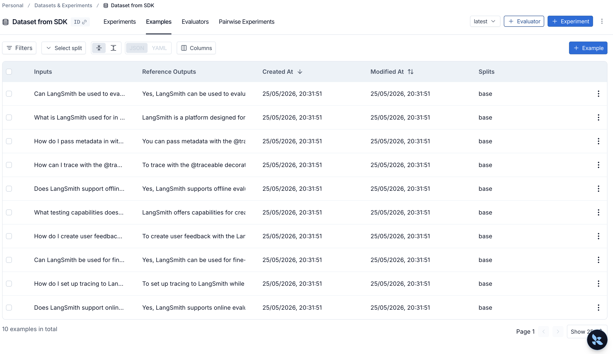

# AI Agents Apps

Small, self-contained demos for LangGraph, LangChain, RAG, CrewAI, guardrails, and LangSmith. Each folder is its own mini-app.

## Quick start

Most Python projects use [uv](https://docs.astral.sh/uv/). Open a project folder, add API keys to `.env`, run `uv sync`, then `uv run main.py`.

Exceptions: [stock_briefing_crewai](crewAI/stock_briefing_crewai/) uses `crewai run`; [langsmith-pynb](langsmith/langsmith-pynb/) uses Jupyter (see LangSmith below).

## Project index

| #   | Project             | Path                                                                                         | Summary                                                |
| --- | ------------------- | -------------------------------------------------------------------------------------------- | ------------------------------------------------------ |
| 1   | Basic chatbot       | [langgraph/basic-chatbot-langgraph/](langgraph/basic-chatbot-langgraph/)                     | Minimal LangGraph: one chatbot node                    |
| 2   | Multi-node chatbot  | [langgraph/multi-node-chatbot-langgraph/](langgraph/multi-node-chatbot-langgraph/)           | Classifier routes to therapist vs logical agent        |
| 3   | Researcher agent    | [langchain/agents/researcher-agent-langchain/](langchain/agents/researcher-agent-langchain/) | Web + Wikipedia research with structured output        |
| 4   | Weather tool        | [langchain/agents/weather-tool-langchain/](langchain/agents/weather-tool-langchain/)         | Single-tool agent (wttr.in)                            |
| 5   | Memory + tools      | [langchain/agents/memory_tools_langchain/](langchain/agents/memory_tools_langchain/)         | Tools + thread memory via checkpointer                 |
| 6   | FAISS retrieval     | [langchain/retrieval/faiss-langchain/](langchain/retrieval/faiss-langchain/)                 | Retriever tool + agent over tiny corpus                |
| 7   | Image (vision)      | [langchain/multimodal/image_langchain/](langchain/multimodal/image_langchain/)               | Image URL + text in one message                        |
| 8   | Local RAG           | [RAG/local-ai-agent-RAG/](RAG/local-ai-agent-RAG/)                                           | Chroma + Ollama over restaurant reviews                |
| 9   | Stock briefing crew | [crewAI/stock_briefing_crewai/](crewAI/stock_briefing_crewai/)                               | Multi-agent daily stock brief                          |
| 10  | PII guardrails      | [guardrails/pii-detection-langchain/](guardrails/pii-detection-langchain/)                   | Redact / mask / block PII on input                     |
| 11  | Human-in-the-loop   | [guardrails/human-in-loop-langchain/](guardrails/human-in-loop-langchain/)                   | Approve sensitive tools before they run                |
| 12  | Custom guardrails   | [guardrails/custom-guardrails/](guardrails/custom-guardrails/)                               | Keyword filter + optional safety check                 |
| 13  | Intro to LangSmith  | [langsmith/langsmith-pynb/](langsmith/langsmith-pynb/)                                       | Academy course notebooks (tracing, evals, prompts)     |
| 14  | LangSmith datasets  | [langsmith/langsmith-datasets/](langsmith/langsmith-datasets/)                               | Upload LangSmith FAQ examples to a dataset via the SDK |

## Repository layout

- [langgraph/](langgraph/) — graph-based chat workflows
- [langchain/](langchain/) — agents, retrieval, multimodal
- [RAG/](RAG/) — end-to-end retrieval apps
- [crewAI/](crewAI/) — multi-agent crews
- [guardrails/](guardrails/) — safety and approval middleware
- [langsmith/](langsmith/) — LangSmith course notebooks and SDK dataset uploads
  - [langsmith-pynb/](langsmith/langsmith-pynb/) — Introduction to LangSmith notebooks
  - [langsmith-datasets/](langsmith/langsmith-datasets/) — Bulk-upload examples via the SDK

---

## LangGraph

### 1. Basic chatbot

[langgraph/basic-chatbot-langgraph/](langgraph/basic-chatbot-langgraph/) — Single-node graph: messages in → model → reply out.

### 2. Multi-node chatbot

[langgraph/multi-node-chatbot-langgraph/](langgraph/multi-node-chatbot-langgraph/) — Classifier picks emotional vs logical path; two different assistant nodes.

---

## LangChain

### Agents

[langchain/agents/](langchain/agents/)

| Project                                                                    | What it shows                                                     |
| -------------------------------------------------------------------------- | ----------------------------------------------------------------- |
| [researcher-agent-langchain](langchain/agents/researcher-agent-langchain/) | Tool-calling agent, DuckDuckGo + Wikipedia, Pydantic output       |
| [weather-tool-langchain](langchain/agents/weather-tool-langchain/)         | Agent with one weather tool; optional streaming                   |
| [memory_tools_langchain](langchain/agents/memory_tools_langchain/)         | Multiple tools, structured output, conversation memory per thread |

### Retrieval

[langchain/retrieval/faiss-langchain/](langchain/retrieval/faiss-langchain/) — FAISS + embeddings, retriever tool, agent answers from a small in-memory KB.

### Multimodal

[langchain/multimodal/image_langchain/](langchain/multimodal/image_langchain/) — Send text + image URL to a vision-capable model.

---

## RAG

[RAG/local-ai-agent-RAG/](RAG/local-ai-agent-RAG/) — Ingest CSV reviews into Chroma (Ollama embeddings), ask questions in a REPL-style loop. Uses vector.py to build the DB and main.py for queries.

---

## CrewAI

[crewAI/stock_briefing_crewai/](crewAI/stock_briefing_crewai/) — Sequential crew: collect market data → summarize → risk check → write brief. Install with crewai, set OPENAI_API_KEY in .env, then crewai run. Default ticker example: AAPL.

---

## Guardrails

[guardrails/](guardrails/) — LangChain middleware demos (uv, Python 3.14). Set OPENAI_API_KEY in .env and run main.py from each project folder.

| Project                                                        | Idea                                                     |
| -------------------------------------------------------------- | -------------------------------------------------------- |
| [pii-detection-langchain](guardrails/pii-detection-langchain/) | Built-in PII middleware (redact, mask, block)            |
| [human-in-loop-langchain](guardrails/human-in-loop-langchain/) | Pause for approval on sensitive tools                    |
| [custom-guardrails](guardrails/custom-guardrails/)             | Custom middleware (keyword block, optional safety model) |

Docs: [LangChain guardrails](https://docs.langchain.com/oss/python/langchain/guardrails#built-in-guardrails)

---

## LangSmith

[langsmith/langsmith-pynb/](langsmith/langsmith-pynb/) — Notebooks for [Introduction to LangSmith](https://academy.langchain.com/courses/intro-to-langsmith) (upstream: [intro-to-langsmith](https://github.com/langchain-ai/intro-to-langsmith)).

| Module | Topics                            |
| ------ | --------------------------------- |
| 0–1    | Tracing, run types, threads       |
| 2      | Datasets, evaluators, experiments |
| 3      | Prompt engineering, Prompt Hub    |
| 4      | Human feedback                    |
| 5      | Monitoring, online evaluation     |

Python 3.12–3.13. Copy example.env to .env, add LANGSMITH_API_KEY and OPENAI_API_KEY, then uv sync and env_utils.py to verify. Launch notebooks with Jupyter Lab.

Full setup: [langsmith/langsmith-pynb/README.md](langsmith/langsmith-pynb/README.md)

### LangSmith datasets (SDK)

[langsmith/langsmith-datasets/](langsmith/langsmith-datasets/) — Script that bulk-uploads question/answer pairs into an existing LangSmith dataset using `Client.create_examples()`. The examples are LangSmith FAQ-style prompts (tracing, `@traceable`, evals, feedback, agents, and similar topics).

